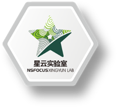

# gRPC内存马

## 版权声明
完整代码：https://github.com/snailll/gRPCDemo

本文章著作权归作者所有。转载请注明出处！https://github.com/snailll

# 绿盟-星云实验室

<h1 align="center">
  
   
</h1>
星云实验室专注于云计算安全、解决方案研究与虚拟化网络安全问题研究。基于IaaS环境的安全防护，利用SDN/NFV等新技术和新理念，提出了软件定义安全的云安全防护体系。承担并完成多个国家、省、市以及行业重点单位创新研究课题，已成功孵化落地绿盟科技云安全解决方案。